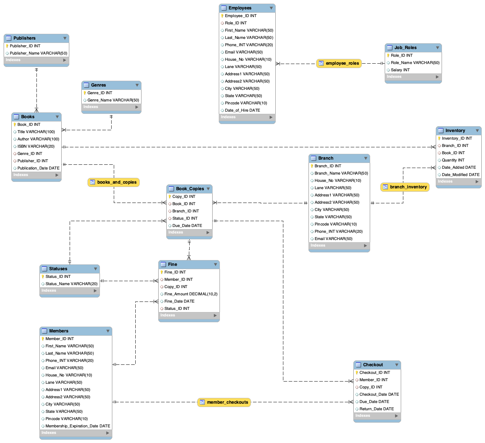

<a name="readme-top"></a>

[![Contributors][contributors-shield]][contributors-url]
[![Forks][forks-shield]][forks-url]
[![Stargazers][stars-shield]][stars-url]
[![Issues][issues-shield]][issues-url]
[![MIT License][license-shield]][license-url]
[![LinkedIn][linkedin-shield]][linkedin-url]

<!-- PROJECT LOGO -->
<br />
<div align="center">
  <a href="https://github.com/MateuszKrolik/MsSQL_Library">
    
  </a>

<h3 align="center">Library DataBase</h3>

  <p align="center">
    <br />
    <a href="https://github.com/MateuszKrolik/MsSQL_Library"><strong>Explore the docs »</strong></a>
    <br />
    <br />
    <a href="https://github.com/MateuszKrolik/MsSQL_Library">View Demo</a>
    ·
    <a href="https://github.com/MateuszKrolik/MsSQL_Library/issues">Report Bug</a>
    ·
    <a href="https://github.com/MateuszKrolik/MsSQL_Library/issues">Request Feature</a>
  </p>
</div>

<!-- TABLE OF CONTENTS -->
<details>
  <summary>Table of Contents</summary>
  <ol>
    <li>
      <a href="#about-the-project">About The Project</a>
      <ul>
        <li><a href="#built-with">Built With</a></li>
      </ul>
    </li>
    <li>
      <a href="#getting-started">Getting Started</a>
      <ul>
        <li><a href="#prerequisites">Prerequisites</a></li>
        <li><a href="#installation">Installation</a></li>
      </ul>
    </li>
    <li><a href="#usage">Usage</a></li>
    <li><a href="#roadmap">Roadmap</a></li>
    <li><a href="#contributing">Contributing</a></li>
    <li><a href="#license">License</a></li>
    <li><a href="#contact">Contact</a></li>
    <li><a href="#acknowledgments">Acknowledgments</a></li>
  </ol>
</details>

<!-- ABOUT THE PROJECT -->

## About The Project



[![Product Name Screen Shot][product-screenshot]](https://github.com/MateuszKrolik/MsSQL_Library)

### Built With

- [![MSSQL][MSSQL]][MSSQL-url]
- [![MySQL][MySQL]][MySQL-url]
- [![SQL][SQL]][SQL-url]
- [![Docker][Docker]][Docker-url]
- [![Azure Data Studio][Azure Data Studio]][Azure Data Studio-url]
- [![Linux][Linux]][Linux-url]
- [![Bash][Bash]][Bash-url]

<p align="right">(<a href="#readme-top">back to top</a>)</p>

<!-- GETTING STARTED -->

## Getting Started

For starters i recommend having Ms-SQL-Server Express installed.

For Smooth Editing Experience on an ARM Mac, I also recommend having DockerDesktop and Azure Data Studio.

### Prerequisites

For ARM MacOS you can also pull Azure SQL Edge Image from DockerHub(as I did).

### Installation

1. Clone the repo
   ```sh
   git clone https://github.com/MateuszKrolik/MsSQL_Library.git
   ```
2. Run the Azure SQL-Edge Image using Docker and create a volume to store host(ARM MacOS):
   ```sh
   sudo docker run --cap-add SYS_PTRACE -e 'ACCEPT_EULA=1' -e 'MSSQL_SA_PASSWORD=<YourStrongPassword>' -e 'MSSQL_PID=Developer' -p 1433:1433 -v /Users/<yourUserName>/<yourCatalog>/<yourDirectory>:/var/opt/mssql --name azuresqledge -d mcr.microsoft.com/azure-sql-edge
   ```
3. Later in AzureDataStudio in server field enter:
   ```
   server=localhost,1433
   ```

<p align="right">(<a href="#readme-top">back to top</a>)</p>

<!-- USAGE EXAMPLES -->

## Usage

_For more examples, please refer to the [Documentation](https://github.com/MateuszKrolik/MsSQL_Library)_

<p align="right">(<a href="#readme-top">back to top</a>)</p>

1. Zaprojektować bazę danych np. dla biblioteki.
   Zaprojektowana baza powinna posiadać kilkanaście (10+) tabel oraz kilka tabel słownikowych (2+). Utworzyć klucze główne (PK) oraz klucze obce (FK). Rozważyć, czy
   kluczem głównym (PK) może być któraś z kolumn reprezentująca faktyczne dane, jeżeli
   nie to dodać dodatkową kolumnę Id.
   W przypadku bazy dla biblioteki powinny one umożliwiać przechowywanie informacji o
   księgozbiorze, autorach, użytkownikach i wypożyczalniach.

2. Opracować skrypt SQL tworzący zaprojektowaną bazę w środowisku Microsoft SQL
   Server.

```sql
-- 1/3 Dictionary/LookUp Tables
CREATE TABLE Genres (
  Genre_ID INT PRIMARY KEY IDENTITY(1,1),
  Genre_Name NVARCHAR(50)
);

-- 2/3 Dictionary/LookUp Tables
CREATE TABLE Publishers (
  Publisher_ID INT PRIMARY KEY IDENTITY(1,1),
  Publisher_Name NVARCHAR(50)
);

-- 3/3 Dictionary/LookUp Tables
CREATE TABLE Statuses (
  Status_ID INT PRIMARY KEY IDENTITY(1,1),
  Status_Name NVARCHAR(20)
);

-- 4/12 Tables
CREATE TABLE Books (
  Book_ID INT PRIMARY KEY IDENTITY(1,1),
  Title NVARCHAR(100),
  Author NVARCHAR(100),
  ISBN NVARCHAR(20),
  Genre_ID INT,
  Publisher_ID INT,
  Publication_Date DATE,
  FOREIGN KEY (Genre_ID) REFERENCES Genres(Genre_ID),
  FOREIGN KEY (Publisher_ID) REFERENCES Publishers(Publisher_ID)
);

-- 5/12 Tables
CREATE TABLE Branch (
  Branch_ID INT PRIMARY KEY IDENTITY(1,1),
  Branch_Name NVARCHAR(50),
  House_No NVARCHAR(10),
  Lane NVARCHAR(50),
  Address1 NVARCHAR(50),
  Address2 NVARCHAR(50),
  City NVARCHAR(50),
  State NVARCHAR(50),
  Pincode NVARCHAR(10),
  Phone_INT NVARCHAR(20),
  Email NVARCHAR(50)
);

-- 6/12 Tables
CREATE TABLE Book_Copies (
  Copy_ID INT PRIMARY KEY IDENTITY(1,1),
  Book_ID INT,
  Branch_ID INT,
  Status_ID INT,
  Due_Date DATE,
  FOREIGN KEY (Book_ID) REFERENCES Books(Book_ID),
  FOREIGN KEY (Branch_ID) REFERENCES Branch(Branch_ID),
  FOREIGN KEY (Status_ID) REFERENCES Statuses(Status_ID)
);

-- 7/12 Tables
CREATE TABLE Members (
  Member_ID INT PRIMARY KEY IDENTITY(1,1),
  First_Name NVARCHAR(50),
  Last_Name NVARCHAR(50),
  Phone_INT NVARCHAR(20),
  Email NVARCHAR(50),
  House_No NVARCHAR(10),
  Lane NVARCHAR(50),
  Address1 NVARCHAR(50),
  Address2 NVARCHAR(50),
  City NVARCHAR(50),
  State NVARCHAR(50),
  Pincode NVARCHAR(10),
  Membership_Expiration_Date DATE
);

-- 8/12 Tables
CREATE TABLE Checkout (
  Checkout_ID INT PRIMARY KEY IDENTITY(1,1),
  Member_ID INT,
  Copy_ID INT,
  Checkout_Date DATE,
  Due_Date DATE,
  Return_Date DATE,
  FOREIGN KEY (Member_ID) REFERENCES Members(Member_ID),
  FOREIGN KEY (Copy_ID) REFERENCES Book_Copies(Copy_ID)
);

-- 9/12 Tables
CREATE TABLE Fine (
  Fine_ID INT PRIMARY KEY IDENTITY(1,1),
  Member_ID INT,
  Copy_ID INT,
  Fine_Amount DECIMAL(10, 2),
  Fine_Date DATE,
  Status_ID INT,
  FOREIGN KEY (Member_ID) REFERENCES Members(Member_ID),
  FOREIGN KEY (Copy_ID) REFERENCES Book_Copies(Copy_ID),
  FOREIGN KEY (Status_ID) REFERENCES Statuses(Status_ID)
);

-- 10/12 Tables
CREATE TABLE Job_Roles (
  Role_ID INT PRIMARY KEY IDENTITY(1,1),
  Role_Name NVARCHAR(50),
  Salary INT
);

-- 11/12 Tables
CREATE TABLE Employees (
  Employee_ID INT PRIMARY KEY IDENTITY(1,1),
  Role_ID INT,
  First_Name NVARCHAR(50),
  Last_Name NVARCHAR(50),
  Phone_INT NVARCHAR(20),
  Email NVARCHAR(50),
  House_No NVARCHAR(10),
  Lane NVARCHAR(50),
  Address1 NVARCHAR(50),
  Address2 NVARCHAR(50),
  City NVARCHAR(50),
  State NVARCHAR(50),
  Pincode NVARCHAR(10),
  Date_of_Hire DATE,
  FOREIGN KEY (Role_ID) REFERENCES Job_Roles(Role_ID)
);

-- 12/12 Tables
CREATE TABLE Inventory (
  Inventory_ID INT PRIMARY KEY IDENTITY(1,1),
  Branch_ID INT,
  Book_ID INT,
  Quantity INT,
  Date_Added DATE,
  Date_Modified DATE,
  FOREIGN KEY (Branch_ID) REFERENCES Branch(Branch_ID),
  FOREIGN KEY (Book_ID) REFERENCES Books(Book_ID)
);
```

3. Zaprojektować kilka (3+) widoków umożliwiających wygenerowanie zestawień z kilku
   tabel, np. wypożyczenia po terminie, wszystkie aktywne wypożyczenia, książki, które
   obecnie nie są dostępne do wypożyczenia, itp.

```sql
GO
CREATE VIEW Books_and_Copies AS
SELECT B.Title, B.Author, BC.Copy_ID, S.Status_Name
FROM Books B
JOIN Book_Copies BC ON B.Book_ID = BC.Book_ID
JOIN Statuses S ON BC.Status_ID = S.Status_ID;

GO
CREATE VIEW Member_Checkouts AS
SELECT M.First_Name, M.Last_Name, B.Title, C.Due_Date
FROM Members M
JOIN Checkout C ON M.Member_ID = C.Member_ID
JOIN Book_Copies BC ON C.Copy_ID = BC.Copy_ID
JOIN Books B ON BC.Book_ID = B.Book_ID;

GO
CREATE VIEW Branch_Inventory AS
SELECT Br.Branch_Name, B.Title, I.Quantity
FROM Branch Br
JOIN Inventory I ON Br.Branch_ID = I.Branch_ID
JOIN Books B ON I.Book_ID = B.Book_ID;

GO
CREATE VIEW Employee_Roles AS
SELECT E.First_Name, E.Last_Name, JR.Role_Name, JR.Salary
FROM Employees E
JOIN Job_Roles JR ON E.Role_ID = JR.Role_ID;
```

4. Zaprojektować procedury składowane do operacji insert, update i delete dla tabel, na których będą one często wykonywane.

```sql
GO
CREATE PROCEDURE InsertBook
    @Title NVARCHAR(100),
    @Author NVARCHAR(100),
    @ISBN NVARCHAR(20),
    @Genre_ID INT,
    @Publisher_ID INT,
    @Publication_Date DATE
AS
BEGIN
    INSERT INTO Books(Title, Author, ISBN, Genre_ID, Publisher_ID, Publication_Date)
    VALUES (@Title, @Author, @ISBN, @Genre_ID, @Publisher_ID, @Publication_Date);
END;

GO
CREATE PROCEDURE UpdateBook
    @Book_ID INT,
    @Title NVARCHAR(100),
    @Author NVARCHAR(100),
    @ISBN NVARCHAR(20),
    @Genre_ID INT,
    @Publisher_ID INT,
    @Publication_Date DATE
AS
BEGIN
    UPDATE Books
    SET Title = @Title, Author = @Author, ISBN = @ISBN, Genre_ID = @Genre_ID, Publisher_ID = @Publisher_ID, Publication_Date = @Publication_Date
    WHERE Book_ID = @Book_ID;
END;

GO
CREATE PROCEDURE DeleteBook
    @Book_ID INT
AS
BEGIN
    DELETE FROM Books
    WHERE Book_ID = @Book_ID;
END;

GO
CREATE PROCEDURE InsertMember
    @First_Name NVARCHAR(50),
    @Last_Name NVARCHAR(50),
    @Phone_INT NVARCHAR(20),
    @Email NVARCHAR(50),
    @House_No NVARCHAR(10),
    @Lane NVARCHAR(50),
    @Address1 NVARCHAR(50),
    @Address2 NVARCHAR(50),
    @City NVARCHAR(50),
    @State NVARCHAR(50),
    @Pincode NVARCHAR(10),
    @Membership_Expiration_Date DATE
AS
BEGIN
    INSERT INTO Members(First_Name, Last_Name, Phone_INT, Email, House_No, Lane, Address1, Address2, City, State, Pincode, Membership_Expiration_Date)
    VALUES (@First_Name, @Last_Name, @Phone_INT, @Email, @House_No, @Lane, @Address1, @Address2, @City, @State, @Pincode, @Membership_Expiration_Date);
END;

GO
CREATE PROCEDURE UpdateMember
    @Member_ID INT,
    @First_Name NVARCHAR(50),
    @Last_Name NVARCHAR(50),
    @Phone_INT NVARCHAR(20),
    @Email NVARCHAR(50),
    @House_No NVARCHAR(10),
    @Lane NVARCHAR(50),
    @Address1 NVARCHAR(50),
    @Address2 NVARCHAR(50),
    @City NVARCHAR(50),
    @State NVARCHAR(50),
    @Pincode NVARCHAR(10),
    @Membership_Expiration_Date DATE
AS
BEGIN
    UPDATE Members
    SET First_Name = @First_Name, Last_Name = @Last_Name, Phone_INT = @Phone_INT, Email = @Email, House_No = @House_No, Lane = @Lane, Address1 = @Address1, Address2 = @Address2, City = @City, State = @State, Pincode = @Pincode, Membership_Expiration_Date = @Membership_Expiration_Date
    WHERE Member_ID = @Member_ID;
END;

GO
CREATE PROCEDURE DeleteMember
    @Member_ID INT
AS
BEGIN
    DELETE FROM Members
    WHERE Member_ID = @Member_ID;
END;
```

5. Zaprojektować procedury składowane umożliwiające sparametryzowane wyświetlanie
   danych, np. wszystkie aktywne wypożyczenia danego użytkownika, wszystkie
   wypożyczenia danej książki, itp.

```sql
GO
CREATE PROCEDURE DisplayBooksByGenre
    @Genre_ID INT
AS
BEGIN
    SELECT * FROM Books
    WHERE Genre_ID = @Genre_ID;
END;

GO
CREATE PROCEDURE DisplayEmployeesByRole
    @Role_ID INT
AS
BEGIN
    SELECT * FROM Employees
    WHERE Role_ID = @Role_ID;
END;
```

6. \*) Dokonać migracji (opracować skrypt SQL) zaprojektowanej bazy danych do innego środowiska np. SQLite albo MySQL.


<!-- ROADMAP -->

## Roadmap

- [x] Data Normalization:
  - [x] First-Normal-Form (1NF):
    - Each table has a primary key (PK).
    - All columns contain atomic (indivisible) values.
  - [x] Second-Normal-Form (2NF):
    - Each table has a primary key (PK).
    - All non-key attributes are fully dependent on the PK (eliminates partial dependencies).
  - [x] Third-Normal-Form (3NF):
    - All non-key attributes are directly dependent on the primary key.
    - No non-key attribute depends on other non-key attributes (eliminates transitive dependencies).
- [x] Junction Tables for handling Many-to-Many RelationShips
- [x] Auto Incrementing Primary-Keys
- [x] Dictionary/LookUp Tables
- [x] Views and Stored Procedures
- [x] RDBMS migration script from MsSQL to MySQL
- [x] Visualized SQL Schema (WorkBench Reverse-Engineering/Azure Data Studio Schema Visualization Extension)
- [x] DockerVolume to Store Database Dumps

See the [open issues](https://github.com/MateuszKrolik/MsSQL_Library/issues) for a full list of proposed features (and known issues).

<p align="right">(<a href="#readme-top">back to top</a>)</p>

<!-- CONTRIBUTING -->

## Contributing

Contributions are what make the open source community such an amazing place to learn, inspire, and create. Any contributions you make are **greatly appreciated**.

If you have a suggestion that would make this better, please fork the repo and create a pull request. You can also simply open an issue with the tag "enhancement".
Don't forget to give the project a star! Thanks again!

1. Fork the Project
2. Create your Feature Branch (`git checkout -b feature/AmazingFeature`)
3. Commit your Changes (`git commit -m 'Add some AmazingFeature'`)
4. Push to the Branch (`git push origin feature/AmazingFeature`)
5. Open a Pull Request

<p align="right">(<a href="#readme-top">back to top</a>)</p>

<!-- LICENSE -->

## License

Distributed under the MIT License. See `LICENSE` for more information.

<p align="right">(<a href="#readme-top">back to top</a>)</p>

<!-- CONTACT -->

## Contact

Email - [mateuszkrolik87@gmail.com](mailto:mateuszkrolik87@gmail.com)

Project Link: [https://github.com/MateuszKrolik/MsSQL_Library](https://github.com/MateuszKrolik/MsSQL_Library)

<p align="right">(<a href="#readme-top">back to top</a>)</p>

<!-- ACKNOWLEDGMENTS -->

## Acknowledgments

- [Img Shields](https://shields.io)
- [SVG Repo](https://www.svgrepo.com/)

<p align="right">(<a href="#readme-top">back to top</a>)</p>

<!-- MARKDOWN LINKS & IMAGES -->
<!-- https://www.markdownguide.org/basic-syntax/#reference-style-links -->

[contributors-shield]: https://img.shields.io/github/contributors/MateuszKrolik/MsSQL_Library.svg?style=for-the-badge
[contributors-url]: https://github.com/MateuszKrolik/MsSQL_Library/graphs/contributors
[forks-shield]: https://img.shields.io/github/forks/MateuszKrolik/MsSQL_Library.svg?style=for-the-badge
[forks-url]: https://github.com/MateuszKrolik/MsSQL_Library/network/members
[stars-shield]: https://img.shields.io/github/stars/MateuszKrolik/MsSQL_Library.svg?style=for-the-badge
[stars-url]: https://github.com/MateuszKrolik/MsSQL_Library/stargazers
[issues-shield]: https://img.shields.io/github/issues/MateuszKrolik/MsSQL_Library.svg?style=for-the-badge
[issues-url]: https://github.com/MateuszKrolik/MsSQL_Library/issues
[license-shield]: https://img.shields.io/github/license/MateuszKrolik/MsSQL_Library.svg?style=for-the-badge
[license-url]: https://github.com/MateuszKrolik/MsSQL_Library/blob/master/LICENSE
[linkedin-shield]: https://img.shields.io/badge/-LinkedIn-black.svg?style=for-the-badge&logo=linkedin&colorB=555
[linkedin-url]: https://linkedin.com/in/mateusz-królik-8b1862262
[product-screenshot]: images/screenshot.svg
[MSSQL]: https://img.shields.io/badge/MSSQL-CC2927?style=for-the-badge&logo=microsoft-sql-server&logoColor=white
[MSSQL-url]: https://www.microsoft.com/sql-server/
[SQL]: https://img.shields.io/badge/SQL-4479A1?style=for-the-badge&logo=data:image/svg+xml;base64,PHN2ZyB4bWxucz0iaHR0cDovL3d3dy53My5vcmcvMjAwMC9zdmciIHhtbG5zOnhsaW5rPSJodHRwOi8vd3d3LnczLm9yZy8xOTk5L3hsaW5rIiB2aWV3Qm94PSIwIDAgNjEgODEiIGZpbGw9IiNmZmYiIGZpbGwtcnVsZT0iZXZlbm9kZCIgc3Ryb2tlPSIjMDAwIiBzdHJva2UtbGluZWNhcD0icm91bmQiIHN0cm9rZS1saW5lam9pbj0icm91bmQiPjx1c2UgeGxpbms6aHJlZj0iI0EiIHg9Ii41IiB5PSIuNSIvPjxzeW1ib2wgaWQ9IkEiIG92ZXJmbG93PSJ2aXNpYmxlIj48ZyBmaWxsPSIjMDA3MmM2IiBzdHJva2U9Im5vbmUiPjxwYXRoIGQ9Ik0wIDEwLjkyOXY1OC4xNEMwIDc1LjEwNiAxMy40MzIgODAgMzAgODBWMTAuOTI5SDB6Ii8+PHVzZSB4bGluazpocmVmPSIjQyIvPjwvZz48dXNlIHhsaW5rOmhyZWY9IiNDIiBvcGFjaXR5PSIuMTUiIHN0cm9rZT0ibm9uZSIvPjxwYXRoIGQ9Ik02MCAxMC45MjljMCA2LjAzNi0xMy40MzIgMTAuOTI5LTMwIDEwLjkyOVMwIDE2Ljk2NSAwIDEwLjkyOSAxMy40MzIgMCAzMCAwczMwIDQuODkzIDMwIDEwLjkyOSIgc3Ryb2tlPSJub25lIi8+PHBhdGggZD0iTTUzLjg2NiAxMC4yOTljMCAzLjk4NS0xMC42ODUgNy4yMTEtMjMuODY2IDcuMjExUzYuMTMyIDE0LjI4NCA2LjEzMiAxMC4yOTkgMTYuODE5IDMuMDg4IDMwIDMuMDg4czIzLjg2NiAzLjIyOCAyMy44NjYgNy4yMTEiIGZpbGw9IiM3ZmJhMDAiIHN0cm9rZT0ibm9uZSIvPjxwYXRoIGQ9Ik00OC44NjcgMTQuNzA3YzMuMTI0LTEuMjE5IDUuMDAyLTIuNzQ1IDUuMDAyLTQuNDA0QzUzLjg2OCA2LjMxOCA0My4xODMgMy4wOSAzMCAzLjA5UzYuMTM0IDYuMzE4IDYuMTM0IDEwLjMwM2MwIDEuNjU4IDEuODc3IDMuMTg1IDUuMDAyIDQuNDA0IDQuMzYzLTEuNzA0IDExLjE4Mi0yLjgwMyAxOC44NjUtMi44MDNzMTQuNSAxLjA5OSAxOC44NjYgMi44MDMiIGZpbGw9IiNiOGQ0MzIiIHN0cm9rZT0ibm9uZSIvPjxwYXRoIGQ9Ik0yMC40NzIgNTEuMjg3YzAgMS44MDctLjY1MSAzLjIwNi0xLjk1NSA0LjE5N3MtMy4xMDIgMS40ODgtNS4zOTkgMS40ODhjLTEuOTU0IDAtMy41ODctLjM1NC00Ljg5OS0xLjA2M3YtNC4yNTFjMS41MTQgMS4yOTMgMy4xODIgMS45NCA1LjAwNCAxLjk0Ljg4IDAgMS41NjEtLjE3NyAyLjA0MS0uNTMycy43Mi0uODIzLjcyLTEuNDA5YzAtLjU3NS0uMjMxLTEuMDc1LS42OTMtMS41cy0xLjQwMi0uOTc0LTIuODE5LTEuNjQ3Yy0yLjg4OC0xLjM2Mi00LjMzMS0zLjIyNC00LjMzMS01LjU3NyAwLTEuNzA4LjYyOS0zLjA3OCAxLjg4OS00LjExczIuOTMxLTEuNTQ3IDUuMDE2LTEuNTQ3YzEuODQ5IDAgMy4zNzkuMjQ1IDQuNTk2LjczMXYzLjk3MWMtMS4yNzYtLjg4Ni0yLjcyOS0xLjMyOC00LjM1Ny0xLjMyOC0uODE4IDAtMS40NjUuMTc0LTEuOTQuNTIzYTEuNjUgMS42NSAwIDAgMC0uNzEyIDEuNDAxYzAgLjYwMi4xOTEgMS4wOTYuNTc1IDEuNDgxczEuMTY4Ljg2MSAyLjM1NiAxLjQyOGMxLjc3Ljg0MiAzLjAzIDEuNjk1IDMuNzg0IDIuNTYzczEuMTI1IDEuOTUgMS4xMjUgMy4yNDF6bTIwLjM3LTQuMzAyYzAgMi4yNC0uNTA3IDQuMTg1LTEuNTE5IDUuODNzLTIuNDM4IDIuODAxLTQuMjc3IDMuNDY2bDUuNDkxIDUuMTEzaC01LjU0NGwtMy45MjEtNC40MjNjLTEuNjgxLS4wNjEtMy4xOTgtLjUwOS00LjU0OS0xLjM0MXMtMi4zOTUtMS45NzItMy4xMjktMy40Mi0xLjEwMy0zLjA2Mi0xLjEwMy00Ljg0MWMwLTEuOTc0LjM5OC0zLjczNCAxLjE5NC01LjI3OXMxLjkxNi0yLjczNCAzLjM2LTMuNTY2IDMuMDk3LTEuMjQ4IDQuOTY1LTEuMjQ4YzEuNzQxIDAgMy4zMDIuNDAzIDQuNjggMS4yMDlzMi40NDYgMS45NTEgMy4yMDggMy40MzkgMS4xNDQgMy4xNzUgMS4xNDQgNS4wNnptLTQuNDg4LjI0YzAtMS45MzEtLjQxOC0zLjQ1NS0xLjI1NS00LjU3NnMtMS45OC0xLjY4MS0zLjQzMy0xLjY4MWMtMS40NzkgMC0yLjY2Mi41NjItMy41NTIgMS42ODVzLTEuMzMzIDIuNjIxLTEuMzMzIDQuNDg5YzAgMS44Ni40MzUgMy4zNDQgMS4zMDYgNC40NTVzMi4wMjggMS42NjYgMy40NzIgMS42NjZjMS40NzEgMCAyLjYzNi0uNTM4IDMuNDk5LTEuNjEzczEuMjk2LTIuNTUgMS4yOTYtNC40MjZ6bTE4Ljg5MyA5LjQxNEg0My45NzJWMzcuNTk2aDQuMjY0VjUzLjE2aDcuMDF6IiBzdHJva2U9Im5vbmUiLz48L3N5bWJvbD48ZGVmcyA+PHBhdGggaWQ9IkMiIGQ9Ik0yOS41ODkgNzkuOTk5SDMwYzE2LjU2OCAwIDMwLTQuODkyIDMwLTEwLjkyOXYtNTguMTRIMjkuNTg5djY5LjA3eiIvPjwvZGVmcz48L3N2Zz4=
[SQL-url]: https://en.wikipedia.org/wiki/SQL
[Docker]: https://img.shields.io/badge/Docker-2496ED?style=for-the-badge&logo=docker&logoColor=white
[Docker-url]: https://www.docker.com/
[Azure Data Studio]: https://img.shields.io/badge/Azure%20Data%20Studio-0078D4?style=for-the-badge&logo=microsoft-azure&logoColor=white
[Azure Data Studio-url]: https://docs.microsoft.com/sql/azure-data-studio/
[Linux]: https://img.shields.io/badge/Linux-FCC624?style=for-the-badge&logo=linux&logoColor=black
[Linux-url]: https://www.linux.org/
[Bash]: https://img.shields.io/badge/Bash-4EAA25?style=for-the-badge&logo=gnu-bash&logoColor=white
[Bash-url]: https://www.gnu.org/software/bash/
[MySQL]: https://img.shields.io/badge/MySQL-00758F?style=for-the-badge&logo=mysql&logoColor=white
[MySQL-url]: https://www.mysql.com/
